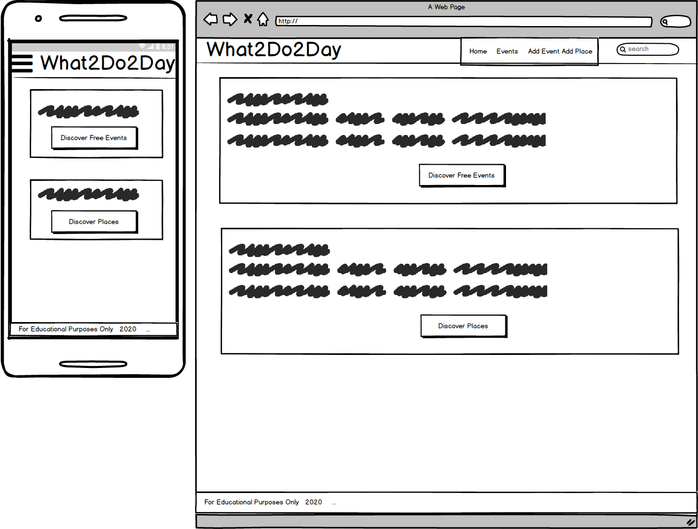
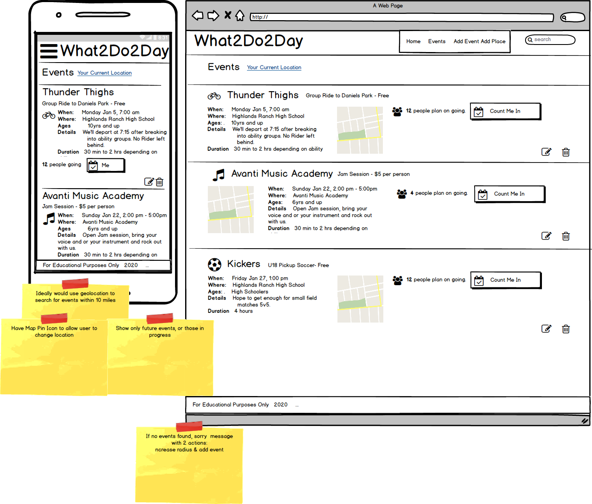
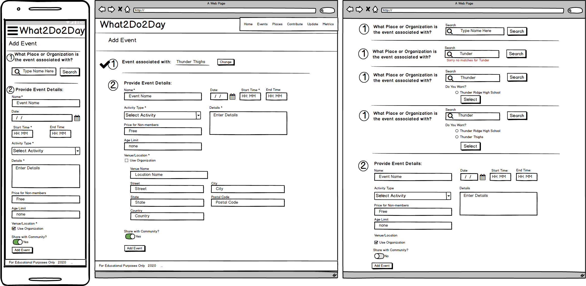

Home Page

- Have cartoons present the about me information.
- Present two call to action buttions: List of Places & List of Events

Events Page 

- List out enabled events that are in the future and enabled, sorted by Date, ascending.
- Paginate results so only 10 show per page on desktop. 
- Allow Filtering of Events by activity, date range, and age range.
- Present google map of each location. 
- Track number of people planning on attending
- Allow users to join an event

Places Page

- List out enabled places alphabetically.
- Allow filtering/sorting by name, activity and rating. 
- Have reviews collapsed, but expandable.
- Have events collapsed, but expandable.
- Show aggregated rating.
- Allow user to add a review.

Review Add Page

- accessible from button on Places Page and Navigation
- if accessed from Navigation, user must search for Place to associate review with

Event Add Page

 - accessible only from button on Places Edit page and navigation
 - presents user with form including the name of the place the event is being added to. 
 - on submit, check that event with same date and place does not already exist. If successful, go back to Events page.
 
Events Edit Page 

- accessed from navigation
- find associated Place first, then list events associated to place with edit buttons (enabled and enabled, but only those in future)
- Once edit is selected, switch to Event Update page. 

Events Update Page 

- display events form field with values prepopulated
- allow user to change values
- on save, check that name and date are unique to associated place.
- when save is successful take user to Events Page

Places Add Page 

- capture user email (newsletters, groupon deals?)
- present form to fill out to make a place
- on submit add warning if Name already exists. 
- If successful, go back to Places Page.

Places Edit Page 

- List out enabled places, sorted by Name, ascending.
- Paginate results so only 10 show per page on desktop. 
- allow filtering/sorting by enabled/disabled and name
- once edit is selected, switch to Places Update Page 

Places Update Page 

- present form prepopulated with inputs to user to update.
- on submit, make sure Name check is performed
- If successful, go back to Places Page.

Review Edit Page 

- Have user find place Review is associated with
- on successful match, list out reviews descending by date with edit buttons
- if no reviews provide add Review button

Review Update Page 

- present form prepopulated with inputs to user to update.
- once changes are saved, return to Places Page

Navigation

- desktop: drop down menu for Contribute and Update menus
- small devices: side bar menu with icons

Site Activity

- flat file of metrics tracking
   - Action: [follow, create, update, attend, Search]
   - Object: [Place, Event, Review]
   - Activity: [slugified value from list]
   - Name: [slugified name daisy chained if event]
- if time, maybe have totals for each unique row without DateTime
