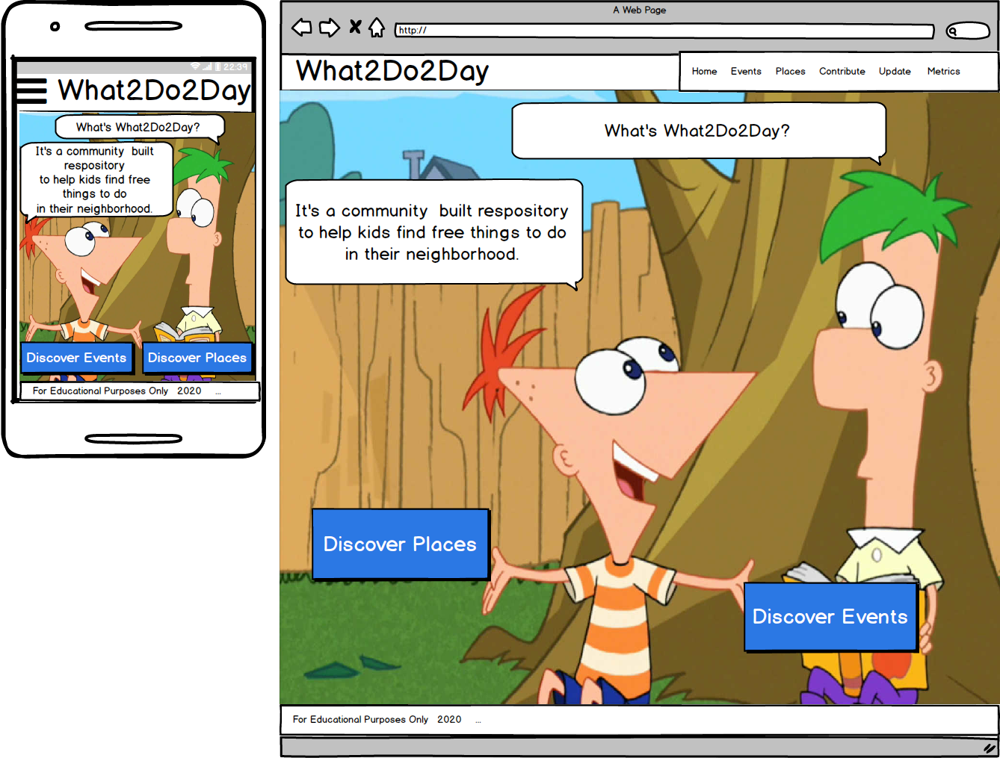
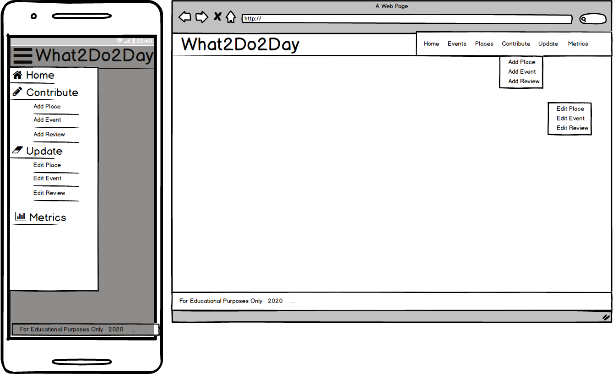

# What2Do2Day Wire-frames
## Author
Malia Havlicek
>## Table of Contents
> - [Home Page](#home-page)
> - [Events Page](#events-list-page)
> - [Filter Events](#filter-events)
> - [Join Event](#join-event)
> - [Places](#places-list-page)
> - [Filter Places](#filter-places)
> - [Follow Place](#follow-place)
> - [Add Review](#add-review)
> - [Add Event](#add-event)
> - [Edit Event](#events-edit-page)
> - [Update Event](#events-update-page)
> - [Add Place](#places-add-page)
> - [Edit Place](#places-edit-page)
> - [Update Place](#places-update-page)
> - [Edit Review](#review-edit-page)
> - [Update Review](#review-update-page)
> - [Navigation](#navigation)
> - [Metrics](#metrics)
> - [Back to README](https://github.com/maliahavlicek/what2do2day#skeleton)

### Home Page

- Have cartoons present the about me information.
- Present two call to action buttions: List of Places & List of Events

### Events List Page 

- List out enabled events that are in the future and enabled, sorted by Date, ascending.
- Paginate results so only 10 show per page on desktop. 
- Allow Filtering of Events by activity, date range, and age range.
- Present google map of each location. 
- Track number of people planning on attending
- Allow users to join an event

### Filter Events

- Modal that allows user to limit events by
  - Activity
  - Age range
  - Date range

### Join Event

- Modal that show event details
- collects email
- sends calendar invite
- updates attendee list

### Places List Page

- List out enabled places alphabetically.
- Allow filtering/sorting by name, activity and rating. 
- Have reviews collapsed, but expandable.
- Have events collapsed, but expandable.
- Show aggregated rating.
- Allow user to add a review.

### Filter Places

- Modal that allows user to filter places by
  - Activity
  - Age Range
  
### Follow Place

- Modal that collects user email and keeps user posted if
  - when the place is updated
  - when the place has a review added
  - when the place posts a new event

### Add Review

- accessible from button on Places Page and Navigation
- if accessed from Navigation, user must search for Place to associate review with

### Add Event

 - accessible only from button on Places Edit page and navigation
 - presents user with form including the name of the place the event is being added to. 
 - on submit, check that event with same date and place does not already exist. If successful, go back to Events page.
 
### Events Edit Page 

- accessed from navigation
- find associated Place first, then list events associated to place with edit buttons (enabled and enabled, but only those in future)
- Once edit is selected, switch to Event Update page. 

### Events Update Page 

- display events form field with values prepopulated
- allow user to change values
- on save, check that name and date are unique to associated place.
- when save is successful take user to Events Page

### Places Add Page 

- capture user email (newsletters, groupon deals?)
- present form to fill out to make a place
- on submit add warning if Name already exists. 
- If successful, go back to Places Page.

### Places Edit Page 

- List out enabled places, sorted by Name, ascending.
- Paginate results so only 10 show per page on desktop. 
- allow filtering/sorting by enabled/disabled and name
- once edit is selected, switch to Places Update Page 

### Places Update Page 

- present form prepopulated with inputs to user to update.
- on submit, make sure Name check is performed
- If successful, go back to Places Page.

### Review Edit Page 

- Have user find place Review is associated with
- on successful match, list out reviews descending by date with edit buttons
- if no reviews provide add Review button

### Review Update Page 

- present form prepopulated with inputs to user to update.
- once changes are saved, return to Places Page

### Navigation

- desktop: drop down menu for Contribute and Update menus
- small devices: side bar menu with icons

### Metrics

- flat file of metrics tracking
  - Action: [follow, create, update, attend, Search]
  - Object: [Place, Event, Review]
  - Activity: [slugified value from list]
  - Name: [slugified name daisy chained if event]
  - if time, maybe have totals for each unique row without DateTime

- [Back to README](https://github.com/maliahavlicek/what2do2day#skeleton)