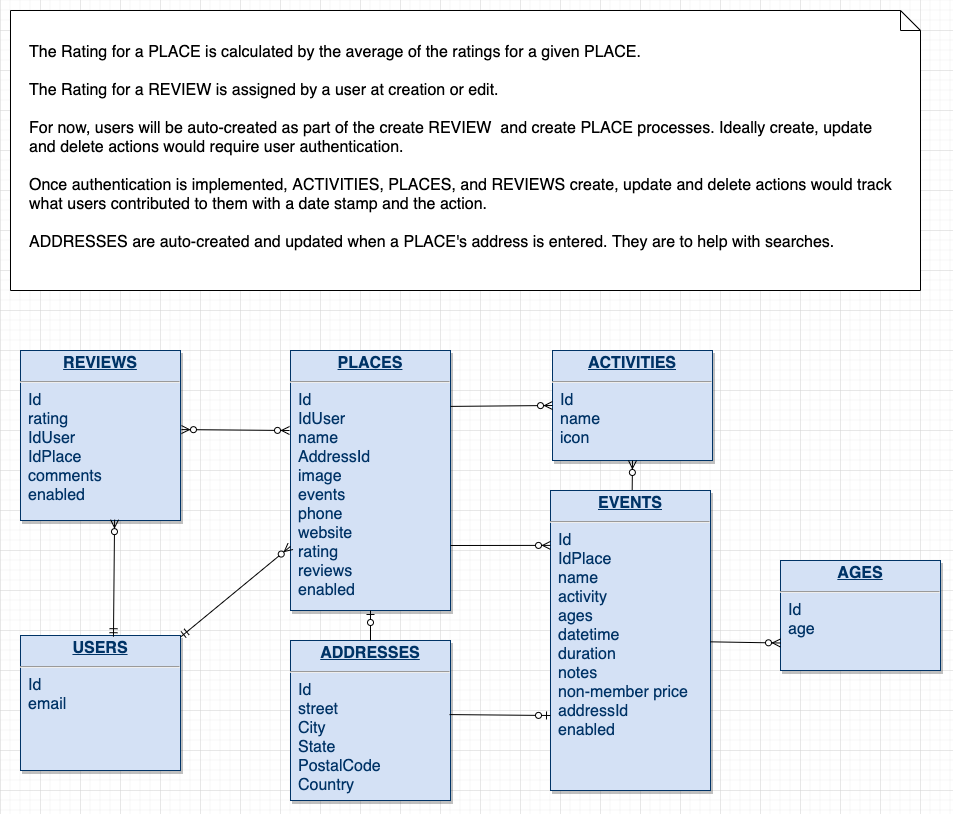
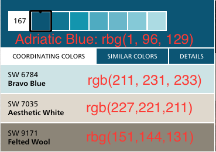

# What2Do2Day
## Author
Malia Havlicek
## Project Overview
This website provides people a way to find free events in their community as a means to solve the question of "What are we gonna do today?" without breaking the bank or needing to travel far from home. Along with finding inexpensive options of what to do today, the site allows users to flag that they are planning on attending an event so other members know they will not be the only one going to a function. 

Users can also see a list of all the places in the community that have ever hosted an event and read reviews about them. Users can add reviews about places to share their experiences and rate organizations. Places, Events, and Reviews can be added, deleted and updated from the site. If an activity doesn't quite fit into the list provided, users can add a new activity when creating an event or place. Small businesses, social groups, and communities would ideally be in charge of their organizations's data and events but in this beta phase, user authentication, roles and permissions are not implemented.

Site owners could enable affiliate linking from any organization associated with the site that results in a booking for paid events by adding a Google Click Identifier (GCLID) to place's url. Site admins could also gather data based on search activity as well as Places and Events with heavy interaction and sell ads on this site to help earn money by targeting audiences of similar interests. (Note how the Places's page has natural side bars in desktop when users are looking at events and reviews)

The name and concept of this site is loosely based on the key phrase, "I know what we're gonna do today!" from the cartoon series [Phineas and Ferb](https://en.wikipedia.org/wiki/Phineas_and_Ferb).
 
>## Table of Contents
> - [UX](#UX)
>   - [Strategy](#Strategy)
>   - [Scope](#Scope)
>   - [Structure](#structure)
>   - [Skeleton](#skeleton)
>   - [Surface](#surface)
>     - [Typography](#typography)
>     - [Image Choice](#image-choice)
>     - [Design Elements](#design-elements)
>     - [Animations & Transitions](#animations--transitions)
>   - [User Stories](#user-stories)
>

## UX
### Strategy
Before launching any website, business partners want to know how they can earn money and if there is a need or demand for the project. Defining business goals of a project from the standpoint of an external user as well as site owners helps you evaluate possible return on investment.

Upon reading the suggested projects for the Data Centric Milestone Project, I came up with 2 ideas:

1.Texting Translator:
> External Goals
>  - Lookup definitions so you know what LOL and MILF means before determining if you need to have a serious talk with your children
>  - Find out what your savvy friend means rather than embarrassing yourself by asking your clueless parents
>  - Correct poor definitions by providing a new one and down voting the older definitions so people are better informed
>
> Site Owner's Goals
>  - Publish T-shirts, & stickers mugs for benign but up to date trends
>
> Features
>   - Create an app that allows users to upload Texting Terms, definitions 
>   - Allow users to Up and Down voting if Definition is Accurate or not.
>   - Create back end code to manage:
>     - Terms
>     - Definitions
>     - Votes
>   - Search, allow users to search terms for a texting phrase they are unfamiliar with 
>   - Metrics about what words were search for the most so owner can Stock Online store accordingly

2.What2Do2Day:
> External Goals
>  - Find something safe for your kids to do near home
>  - Find something that's interesting to me with others I know when mom and dad take away my electronics
>  - Bring Attention to your business or organization by being involved in the community
> 
> Site Owner's Goal
>  - Earn money from affiliate links to businesses that post their places on site when links lead to online sales
>  - Track most popular activities on site to score some money from ads
> 
> Features
>  - Create an app that allows users to upload details about places to do things with kids. Main objects are Places and Events tied to them
>  - Allow users to write reviews about places and rate them
>  - Allow users to follow a place so they know new events posted by that business
>  - Allow users to join an event so other members know how many people might show up
>  - Create back end code to manage:
>    - Reviews
>    - Places
>    - Events
>  - Search, allow searching by activity as means to filter results
>  - Metrics - track follows to business and joins to business as well as visitors to site.

Out of these two concepts, I weighed the pros and cons of each:

__Texting Translator__ 
            
|             Pros               |                        Cons                        |
|--------------------------------|----------------------------------------------------|
| MVP could go live              | Rather Simple                                      |
| Moderate  UX                   | No API integration                                 |
| Scalable to world market       |                                                    |
| Ad & product earnings moderate |                                                    |

__What2Do2Day__

|             Pros               |                        Cons                        |
|--------------------------------|----------------------------------------------------|
| Integration with Google Maps   | Very complex                                       |
| Challenging UX                 | MVP not production worthy, anyone can make updates |
| Scalable to world market       | MVP not production worthy, (kid safety first)      |
| Earnings from Ads is high      |                                                    |
| Social Need is high            |                                                    |

 What2Do2Day has the ability to reach a broader scope of users and could potentially take off like the Nextdoor app.  What2Do2Day is more intriguing and likely to keep users coming back to the site. As a developer, the What2Do2Day app will provide greater value in the long term towards my coding skills due to it's complexity.

### Scope
The concept of What2Do2Day can get extremely intertwined when looking at permissions and roles. I decided that a beta version that skips over authentication, permissions and roles can still provide a clean and efficient minimal viable product (MVP).  Thus user profiles and management of users will not be included initially. 

Restricting results based on user's location would be ideal for a long term solution but it is not necessary for the MVP. Since I do not have experience with Google Maps's Nearby API, this bit of scope will be deferred until a polished core product is developed. Also not enough data will be loaded to make searching and geolocation viable initially.

Creating, adding and updating functionality will only be accessible from menu options. This will allow the MVP to be built to serve the majority of long term users and keep the UX cleaner without an overwhelming amount of buttons. Admin proximity/ease of use functionality can be added later. 

Consolidating Delete functionality into an enable/disable property reduces pages to develop. It also reduces the number of items in the menus and makes overall navigation easier.

Business logic to track search requests, and the events and places that users interact with will be collected.  This will aide in negotiating affiliate link deals and ads will be included but graphical visualization will not be included in the MVP, only a list of the data collected. Likewise we need to know how many users are coming to the site and what percentage of them interact or do not interact with out buttons so we will attempt to track unique visits to our site.

### Structure
In order to have a better idea of the tables and the relationships between them I looked at google Maps' Places API to help determine what fields my place object should have. Knowing the data fields I may want to have and those that were extraneous, helped me devise a rough Entity Relationship Diagram(ERD):
 

After the decision to remove user roles and permissions and some refactoring around fields, I ended up with:

 

### Skeleton
Having the data structure in hand, I knew what data fields I had at hand to present users managing the PLACES, EVENTS and REVIEW objects. I'm not a great artist but I find it easier start hand drawn markups before diving into a wireframing tool. I drafted out the home screen as well as the places list to kick start decisions concerning what data had higher priority.
[view hand drawn mockups](documentation/handdrawn.md)

Once I had the Places list drawn out, I invested several hours to mockup and fine tune the user experience using Basalmiq.
[view balsamiq deck](documentation/balsamiq.md)

Taking the time to do more formal mockups exposed an issue with the crowding of edit buttons and delete buttons. I decided that delete is really an update function since I am using the enabled attribute to hide or show items on the Places and Events pages.  The more formal mockups also allowed me to try several different layouts of the data for the main list pages. The mockkups include layers for searching and in site adding of reviews. Search non-happy paths were also mocked up. 

### Surface:
Below are the decisions and internal dialogs I had to help draw out what the end product will look like.
####Color Choice
I have not had much success with color choice in the past using online tools such as picking colors from imagery via adobe or from color pallet wheels. My color choices pass accessibility audits but something is missing, so this time, I started with the pros at [Sherwin Williams](https://www.sherwin-williams.com/homeowners/color/find-and-explore-colors/paint-colors-by-family/SW6790-adriatic-sea#/6790/?s=coordinatingColors&p=PS0) and came up with the following colors:

I then went to dribble.com and plugged in each of the colors from  Sherwin Williams to find others' pallets that had a cheerful look. Unfortunately Adriatic Blue, Aesthetic White, and Felted Wool all provided me with rather depressing options. Luckily Bravo Blue(\#d3e7e9) turned up a lot of more cheerful looking sites.
- [One nice day](https://dribbble.com/shots/9428106-Vector-illustration-One-nice-day)
- [Online Learning App](https://dribbble.com/shots/9404019-Online-Learning-App)
- [Daily UI 004](https://dribbble.com/shots/9423898-Daily-UI-004)
- [Sign up](https://dribbble.com/shots/9404019-Online-Learning-App)

So I'm hoping I'll have success with the Daily UI 004 color's pallet.

#### Typography
The home page lends itself to a comic strip so I searched Google's handwriting fonts and flagged the top 5 that matched what I had envisioned and typed some example lead text.
- [WalterTurncoat](https://fonts.google.com/specimen/Walter+Turncoat)
- [Sriracha](https://fonts.google.com/specimen/Sriracha)
- [Coming Soon](https://fonts.google.com/specimen/Coming+Soon)
- [Caveat Brush](https://fonts.google.com/specimen/Caveat+Brush)
- [Patrick Hand SC](https://fonts.google.com/specimen/Patrick+Hand+SC)

In my opinion, the Patrick Hand SC font presented itself perfectly for cartoon writing when typing out potential lead text. It was easy to read and I could discern where true capitalization was and saw a difference between capital I's followed by lower case L's.

Next I produced a short list of fonts for my main content by looking at google's suggested pairings of fonts with Patrick Hand SC a list of [best fonts](https://kinsta.com/blog/best-google-fonts/):

- [Lato](https://fonts.google.com/specimen/Lato)
- [Open Sans](https://fonts.google.com/specimen/Open+Sans)
- [Raleway](https://fonts.google.com/specimen/Raleway)

While Open Sans matched the curvy flowing fonts which I was trying to achieve with for my main content, I could not distinguish a capital I from a lower case l, so I chose Raleway as it met that criteria. I don't plan on using many different font weights so I only imported those for normal and bold.

`<link href="https://fonts.googleapis.com/css?family=Patrick+Hand+SC&display=swap" rel="stylesheet">`
`<link href="https://fonts.googleapis.com/css?family=Raleway:500,700&display=swap" rel="stylesheet">`

#### Image Choice
I wanted easily recognizable activities as icons that users could use to associate to events and places on my website rather than allowing them to randomly load garish or naughty symbols, I decided to provide a broad set of icons. I looked at free sets and downloaded icons from [flaticon](https://www.flaticon.com/packs/outdoor-activities-32)
By having icons that are compatible with the colors I plan on using throughout my site, I am hoping to achieve a calm yet cheerful website. 

#### Design Elements
The formal wireframe process identified the need for:
 - top menu bar for desktop
 - side nav bar for mobile
 - modals/layers
 - accordions
 - containers
 - pagination
 - forms
 - maps
 
 I read [best css frameworks]('https://www.creativebloq.com/features/best-css-frameworks'). I looked into foundation and bulma. 
 
 and collapsible drawers, icons for closing modals, chevrons for opening modals, pagination trash cans and more. I've already tried boostrap4.0 and materilize via the tutorials. I looked at https://get.foundation/learn/tutorials.html and although I've used SCSS, i never had to manage what mixins to include before so it's a learning opportunity. 

#### Animations & Transitions
I trolled codrops to look for some inspiration.  These sites gave animation ideas I may never have tried. I went back to my designs and checked where I could reduce the amount of data seen on the lists pages so the user can see more and if they click on the row, it can expand out to full screen and present all the data needed.
 - [expanding search option](https://tympanus.net/Tutorials/ExpandingSearchBar/) 
 - [grid icon expansion](https://tympanus.net/codrops/2013/03/19/thumbnail-grid-with-expanding-preview/)
 - [expanding overlay](https://tympanus.net/Tutorials/ExpandingOverlayEffect/)
 - [fullscreen overly](https://tympanus.net/Development/FullscreenGridPortfolioTemplate/)

 
### User Stories:
Once the mocks up were done and most of the UX decisions were tackled, I looked at the final [mockups](documentation/balsamiq.md) again and wrote out user stories to help breakdown the project into manageable development chunks.

## Features

In this section, you should go over the different parts of your project, and describe each in a sentence or so.

To streamline the development process without the complexity of users and permissions, it was decided that the MVP consists of:
1. Home Page: What are we going to do today screen. Explains purpose of site and includes 2 buttons for Events and Places lists.
1. Places Page:  User sees a list of enabled places. Search functionality for City, State Country, Rating and Activity will be present to reduce results and compensate for no geolocation. Track Activity Search inputs. Track expansion of details and reviews of Places. Allow pagination.
1. Creating Place Page: User inputs values where adding a review and an event are part of the process but not necessarily required. A warning will be provided if the name is found in existing database.
1. Update Place Page: User is presented a find field that will list 5 results with update options including disabled ones. List enabled Places first. If no match found, users can add a place or revise their search criteria. Once the update button is clicked, the user is presented with a form prepopulated with the Place's existing data. Aggregated rating values is visible but cannot be updated. Reviews associated with the place are presented in a list, cannot be managed from this screen. MVP dictates that ease of use/proximity of managing reviews is not essential to initial deployment.
1. Delete Place Page: User is presented a Name find field that will list 5 results of enabled places with delete options. Once a delete button is clicked, the place will be disabled and user will be taken to places list page. Deleted Places will just disable items to prevent user from having to reenter data if the Place is moving locations or undergoing maintenance.
1. Events Page: Display all future events to user ascending by date. Include ability to limit results by City, State Country, Activity to compensate for no geolocation. Track Activity Search inputs. Track expansion of details and count me in interaction. Allow pagination.
1. Create Event Page: User is presented an input field for the place's name it is associated with. If no matches found they can opt to create a place. If matches are found enabled items are listed first. Limit results to 5. Once the create event button is clicked, the user is shown a from to create an event. A warning will be provided upon submit if the Date and Title match an existing event for that Place.
1. Update Event Page: User is presented a find field for the place's name, date and activity to aid in finding the event.  If no matches found they can update their search criteria. If matches are found enabled items are listed first, allow pagination of results. Once the update button is clicked, the user is shown a from prepopulated with the existing entries. Upon submit, the Event's Name and Date is checked against existing events
for the place and the user is warned if a match is found. If no warning, the database is updated and user is returned to the Places page with results limited to that Place. 
1. Deleting Event Page:  User is presented a find field for the place's name, date and activity to aid in finding the event.  If no matches found they can update their search criteria. If matches are found only enabled items are listed. Allow pagination of results. Deleting only disables an event. Once user clicks Delete button, they are returned to the Delete Event Page.
1. Create Review Page: User is presented a find field for the place's name to aid in finding the Place.  If no matches found they can update their search criteria. Only show matches for enabled Places. Limit results to 5.
1. Update Review Page: User is presented a find field for the place's name to aid in finding the Review.  If no places are found they can update their search criteria. Show matches for both enabled and disabled Places, listing enabled first. Limit results to 5. Once a Place is picked, the reviews associated for that Place are listed with enabled first and disabled second. Pagination of results is allowed. Once an update button is clicked, the user is presented with a form field prepopulated with the review's current entries. Clicking the submit button updates the review and takes the user back to the update review page.
1. Delete Review Page: User is presented a find field for the place's name to aid in finding the Review..  If no matches found they can update their search criteria. Show matches for enabled and disabled Places, listing enabled first. Limit results to 5. Once a place is selected, present the user with enabled reviews for that place. Clicking Delete only toggles Review to disabled, return user to Places Page.
1. Create Activity Screen: When creating an event or place, the activity specific to the place may not exist. Only on Add/Update screens of Place or Event will there be a button to access this functionality exist. When clicked the create Activity button exposes two more form fields and hides the Activity drop down. This allows the user to add an activity icon and name. Submitting a Place or Event with these fields exposed will create a new Activity.
1. Navigation

 
### Features Left to Implement
In the long term once this concept proves viable, authentication would be enabled and five sets of roles would accessing the site: 
- <strong>Place Administrators</strong> -  users who have permissions to manage the Place, Events and Activities.
- <strong>External Users Adults</strong> - users who have permissions to grant minor external users  access to the site. Adult users
would also have permissions to manage their profile and create, edit and delete their own reviews.
- <strong>External Users Minors</strong> - users who must be granted permissions to the site by Adult External Users.
Minor users can manage their profile with limited features to help ensure their safety (no images or location settings if
and when those features are added to the site). Minor users can also create, edit and delete their own reviews.
- <strong>Content Admins</strong> -  users who approve reviews for inappropriate content and bot induced batch reviews. Content admins would
also be in charge of setting up ad campaigns.
- <strong>Site Administrators</strong> - users who have permissions to create, update and delete all the data hosted on the site 
(Users, Places, Events, Reviews

## Technologies Used
- [draw.io](https://about.draw.io/features/) - used to create Entity Relationship diagram.
- [balsamiq](https://balsamiq.com/) - used to create more professional mock ups.
- [markdown table generator](https://www.tablesgenerator.com/markdown_tables) - used to help with documentation table formatting
- [JQuery](https://jquery.com)- The project uses **JQuery** to simplify DOM manipulation.

Pygal - charting  http://www.pygal.org/en/stable/documentation/
unittest - testing apis  https://docs.python.org/3/library/unittest.html
google calendar API https://developers.google.com/calendar/v3/reference/events
https://developers.google.com/calendar/create-events

## Testing
 
unittest - testing apis  https://docs.python.org/3/library/unittest.html

In this section, you need to convince the assessor that you have conducted enough testing to legitimately believe that the site works well. Essentially, in this part you will want to go over all of your user stories from the UX section and ensure that they all work as intended, with the project providing an easy and straightforward way for the users to achieve their goals.

Whenever it is feasible, prefer to automate your tests, and if you've done so, provide a brief explanation of your approach, link to the test file(s) and explain how to run them.

For any scenarios that have not been automated, test the user stories manually and provide as much detail as is relevant. A particularly useful form for describing your testing process is via scenarios, such as:

1. Contact form:
    1. Go to the "Contact Us" page
    2. Try to submit the empty form and verify that an error message about the required fields appears
    3. Try to submit the form with an invalid email address and verify that a relevant error message appears
    4. Try to submit the form with all inputs valid and verify that a success message appears.

In addition, you should mention in this section how your project looks and works on different browsers and screen sizes.

You should also mention in this section any interesting bugs or problems you discovered during your testing, even if you haven't addressed them yet.

If this section grows too long, you may want to split it off into a separate file and link to it from here.

## Deployment

This section should describe the process you went through to deploy the project to a hosting platform (e.g. GitHub Pages or Heroku).

In particular, you should provide all details of the differences between the deployed version and the development version, if any, including:
- Different values for environment variables (Heroku Config Vars)?
- Different configuration files?
- Separate git branch?

In addition, if it is not obvious, you should also describe how to run your code locally.

## Credits
[Icons made by Freepik from www.flaticon.com](https://www.flaticon.com/packs/outdoor-activities-32)
[tables in markdown](https://www.tablesgenerator.com/markdown_tables#)
[star rating input](https://codepen.io/jexordexan/pen/yyYEJa)
[toggle switch](https://www.w3schools.com/howto/tryit.asp?filename=tryhow_css_switch)

### Content
- The text for section Y was copied from the [Wikipedia article Z](https://en.wikipedia.org/wiki/Z)

### Media
- The photos used in this site were obtained from ...

### Acknowledgements

- I received inspiration for this project from X

